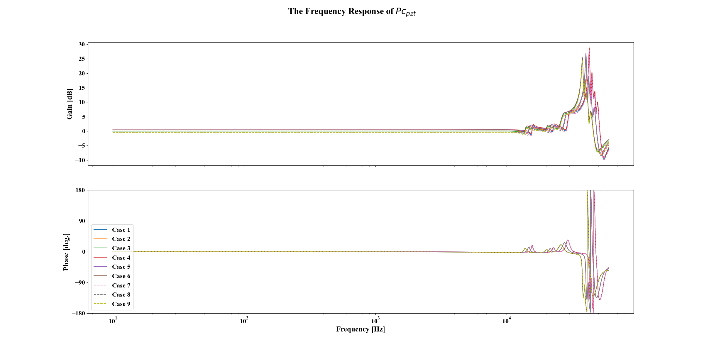
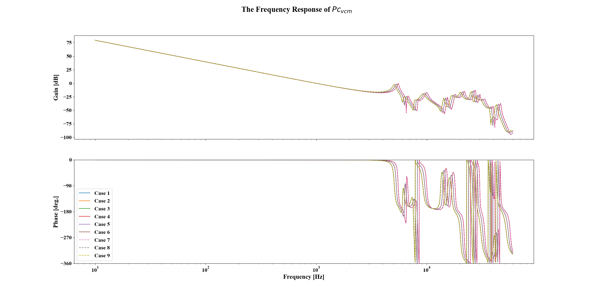
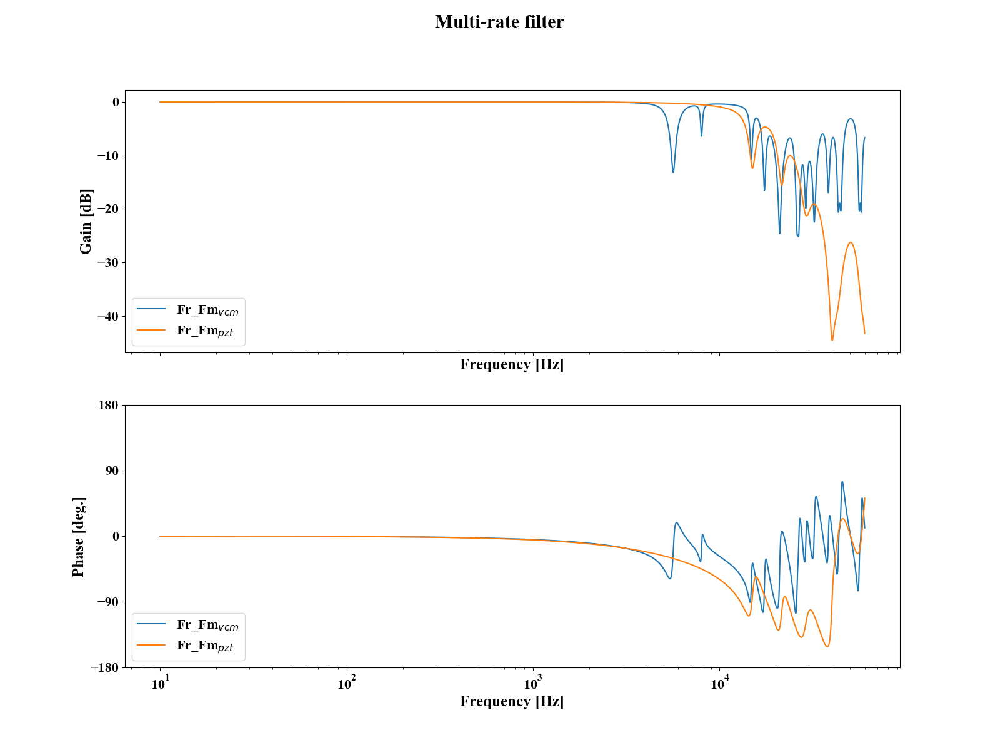
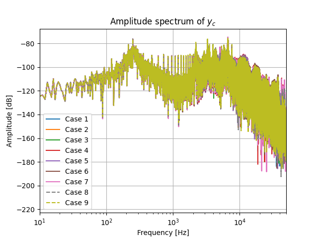
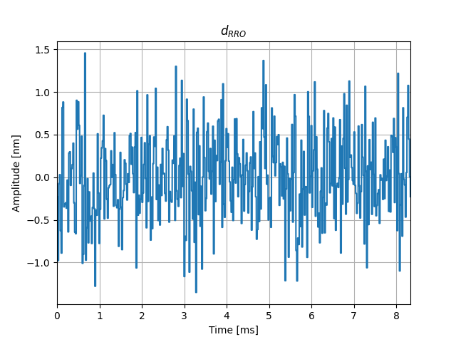

# Summary
Hard disk drives (HDDs) are essential for meeting the growing demand for data storage, as their data capacity must increase to accommodate this need. To achieve higher data capacities, improving the positioning accuracy of the magnetic head in HDDs is crucial. Simulation provides a highly efficient method for studying HDD control systems.

This project establishes a magnetic-head positioning control system for HDDs adapted from MATLAB into Python. The system includes plants, feedback controllers and multi-rate filters for voice coil motors (VCMs) and PZT actuators, while considering various disturbances caused by repeatable run-out (RRO), rotational vibration (RV), and fan-induced vibration. This project also provides 9 built-in cases to represent the different characteristics under varying temperature conditions (low temperature, room temperature, and high temperature) and different PZT actuator gains (± 5%).
The organization and content of this repository are inspired by the Matlab reference source [@Takenori2024Magnetic], and is designed to enhance the navigability and accessibility of Hard Disk Drive (HDD) benchmark problem simulations and their analyses.

By providing a comprehensive and user-friendly platform for simulating and analyzing HDD control systems, this project aims to contribute to the advancement of HDD technology and support the development of more accurate and efficient data storage solutions.

# Statement of Need
Digital servo control of HDD can be achieved by using the Control System Toolbox in Matlab. We translated MATLAB-based benchmark problems for simulating the magnetic-head positioning control system in hard disk drives [@Takenori2024Magnetic] into a Python-based package. Development of the package in Python extends the usability and accessibility of the simulation tool, enabling researchers and engineers to explore and advance the positioning accuracy of the magnetic head in the latest HDDs. The increasing data capacity requirements of hard disk drives motivates improvements in the positioning accuracy of the magnetic head for future advancements in data storage.

Previous research have leveraged the MATLAB version of the HDD package, including research conducted by [@muto2023controller], who proposed a recurrent neural netowrk based (RNN-based) reinforcement learning (RL) solution for HDD control. One of the methods in this study was to to transform the RNN-based controller into a state-space linear controller to ensure stability. Implementing the RNN-based RL solution improved the system performance by 5.8% compared to the original benchmark. [@yabui2023control] developed an adaptive feedforward cancellation (AFC) control to address repeatable runout (RRO) in the tracks of the disk. RRO has the potential to distort the track shape on the disks, affecting overall system performance. By implementing this control system, Yabui et all. independently controlled synchronous and asynchronous RRO, thereby eliminating any interdependencies that could potentially impact the system response. The AFC controller successfully increased the minimum distance in adjacent tracks by 2nm. [@ouyang2023recursive] utilized the HDD benchmark package as one of the applications in their study on system identification. Their approach focused on non-uniformly sampled system identification based on recursive least-squares (RLS) and coprime collaborative sensing. Results from this study demonstrate that the algorithm effectively tracks fast systems beyond the Nyquist frequencies of multiple slow sensors. 

These examples highlight the diverse applications and extensions of studies related to HDD control, indicating a growing demand for its utilization.

# Features & Functionality
This software is used to simulate the magnetic-head positioning control system. The magnetic head consists of a voice coil motors (VCM) and a PZT actuator, as shown in Figure \autoref{fig:HDD}. 

{width=60%}

Figure \autoref{fig:ControlBlockDiagram} shows the control block diagram of magnetic-head positioning control system, where $P_{cv}$ is the VCM in conyinuous-time system, $P_{cp}$ is the PZT actuator in continuous-time system, $C_{dv}$ is the feedback controller for VCM, $C_{dp}$ is the feedback controller for PZT actuator, $F_{mv}$ is the multi-rate filter for VCM, $F_{mp}$ is the multi-rate filter for PZT actuator, $I_p$ is the interpolator, $H_m$ is the multi-rate zero-order hold, $S$ is the samper, $d_p$ is the fan-induced vibration, $d_f$ is the rotational vibration, $d_{RRO}$ is the repeatable run-out (RRO), $y_c$ is the head position in continuous time, $y_d$ is the head position in descrete time, and $y_{cp}$ is the displacement of PZT actuator. As for the disturbances in the system, $d_{RRO}$ is the oscillation of target tracks written on the disk, $d_f$ is the external vibration caused by other HDDs in a storage box, $d_p$ is the external vibration caused by cooling fans in a storage box.

{width=60%}

A total of 9 cases of this system have been included for users to explore. 

| Case No. |    1    |    2    |    3    |     4      |     5      |     6      |     7      |     8      |     9      |
| :------: | :-----: | :-----: | :-----: | :--------: | :--------: | :--------: | :--------: | :--------: | :--------: |
|  Temp.   |   LT    |   RT    |   HT    |     LT     |     RT     |     HT     |     LT     |     RT     |     HT     |
| PZT gain | Nominal | Nominal | Nominal | Nominal+5% | Nominal+5% | Nominal+5% | Nominal-5% | Nominal-5% | Nominal-5% |

The controlled object has vatiations due to temperature dependencies of mechanical resonant frequencies:
- LT (low temperature): +4% VCM nominal values, +6% PZT nominal values.
- RT (room temperature): same as nominal models.
- HT (high temperature): -4% VCM nominal values, -6% PZT nominal values.

Users can create their own system by defining approximate continuous-time systems, examples being any of the 9 use cases, or adjust the VCM and PZT parameters. And the parameters of the nominal controlled object are shown in [@atsumi2019quadruple].

# Description of the Software
- `plant.py` specifies the dynamics of the plant being simulated. 
- `function_simulation.py` executes HDD simulations based on scenarios defined in `plant.py` and saves the outputs to a designated folder. This process may be time-consuming. 
- `simulate_trackfollow.py` displays simulation outcomes, requiring prior generation of simulation result files, and it gives the results of amplitude specturm of $d_f$, $d_p$, and $d_{RRO}$, the output displacement $y_{cp}$ and $y_c$. 
- `plot_control_system.py` visualizes the frequency responses of the control system. 
- `utils.py` includes additional data definitions and utility functions supporting the simulations. 
- `Data_RRO.txt` stores RRO data for function simulation. 
- `Fre_Resp.json` contains frequency response data.

Some exmaple results are shown in Figures \autoref{fig:Pc_pzt} to \autoref{fig:dRRO}. Figure \autoref{fig:Pc_pzt} and Figure \autoref{fig:Pc_vcm} show the frequency response of PZT actuator and VCM, respectively. Figure \autoref{fig:Multi-rate_filter} presents the multi-rate filters of PZT actuator and VCM. Figure \autoref{fig:Amplitude_spectrum_of_yc} illustrates the amplitude spectrum of the head position. Figures \autoref{fig:Amplitude_spectrum_of_df} and \autoref{fig:Amplitude_spectrum_of_dp} display the amplitude spectrum of the rotational vibration and fan-induced vibration, respectively. Finally, Figure \autoref{fig:dRRO} shows the amplitude of the repeatable run-out.

{width=60%}
{width=60%}
{width=60%}
{width=60%}
{width=60%}
{width=60%}
{width=60%}

# Acknowledgements

# References
